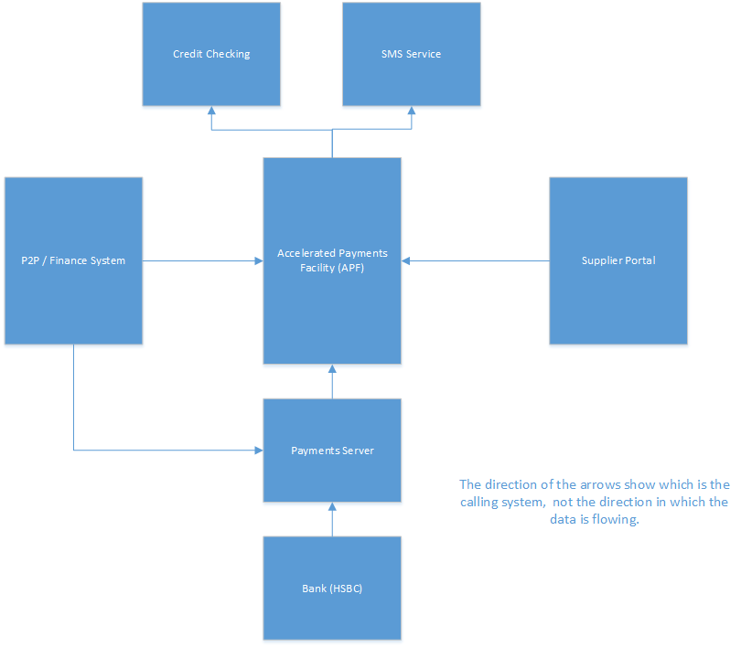

# Overview
The Accelerated Payments Facility (APF) is a self-contained “micro service” which sits between a number of systems as shown in the diagram below.

# Glossary
+ APF – Accelerated Payments Facility.   This is the central piece of software provided by PROACTIS
+ P2P – Purchase-To-Pay system.  This can be either PROACTIS own P2P system or an alternative system provided by a 3rd party such as Coda.
+ KDM – Key Decision Maker.  The responsible party for the supplier
+ AML – Anti-money laundering checks.
+ Application. The request created by the supplier to have their invoices paid as soon as possible.  Each application contains one or more invoices.
+ Payment – Internally within the APF module invoices are referred to as Payments
+ s2c –Source-To-Contract.  The supplier portal provided by PROACTIS.  Also known as Supplier Network.

# Readership
This document is aimed at developers who have been tasked with integrating their own supplier Portal system with APF.
It would be advisable to be familiar with the general APF process before reading this document.

# Intellectual Property
This document contains information related to certain products and services which is proprietary to PROACTIS Group Limited and must not be disclosed, in whole or in part, to any third party.  Notably, all Intellectual property related to the deployment of the Accelerated Payment Facility is to the benefit of and remains the property of PROACTIS Group Limited.

# Important Notes
It should be noted that the PROACTIS APF product is still under active development and changes may be made as a result of testing (either internally or externally).

