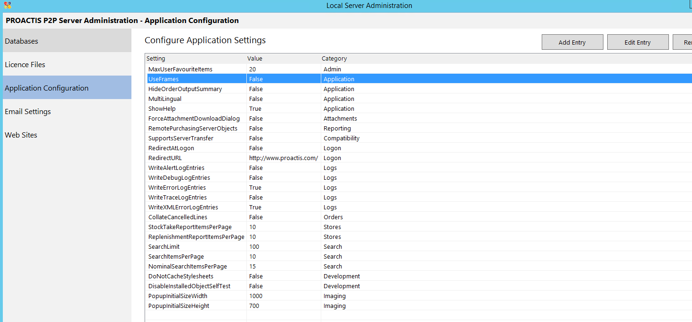

# Application Configuration Settings

# Configuration

The application configuration values control how the P2P product works at a server level.  These can be configured by either directly amending the **ApplicationConfiguration.xml** found in the **ConfigurationFolder** or by using the **PROACTIS Server Administration** tool.

!!! Note

    The Category is only used to organise the settings and is ignored by the server.

## Online Help

| Setting | Default Value | Type | Description |
|---------|-------|------|-------------|
| ShowHelp| False | Boolean | Display the help button at the top right of the window | 

