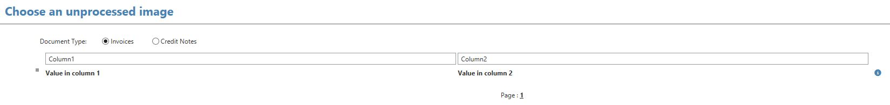
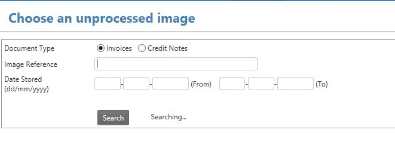
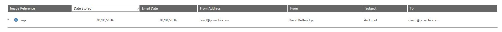
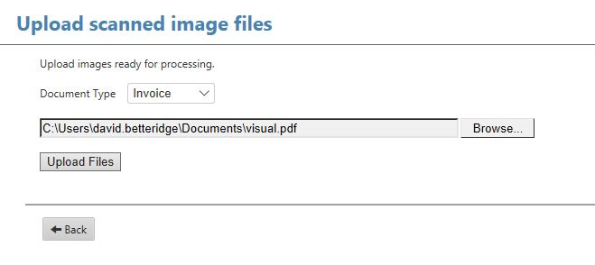

# Custom Imaging DLLs

## Overview
The PROACTIS P2P product has been designed so that it can be easily integrated with a number of different Document Management Systems (DMS).

A typical PROACTIS imaging solution requires the following integration points:-

1.	The scanned image needs to be associated with an invoice within PROACTIS.
2.	Users need to be able to see the original scanned image by clicking a link within the PROACTIS web site.

Although there are many different possible methods available (as different DMS and customers have different requirements) a generic imaging DLL has been written which meets the majority of customer’s requirements.

For the cases where neither the built-in PROACTIS imaging solution or the Generic Imaging DLLs meet your requirements a completely custom DLL can be written.

---

## Viewing Images

+ Create a new C# Class Library project called xyzImaging. ( _xyz_ can be anything)

+ Add a reference to __Purchasing Server\bin\PROACTIS.P2P.grsImagingIface.dll__

+ Add a public class called __Imaging__ which implements the __grsImageIface.IImaging__ interface.

+ Write an implementation of the following methods.
    -   GetImage
    -   GetImageInfo
    -   HasImage

---

### HasImage
Controls if the View Image link is available when looking at a transaction within P2P

```C#
bool IImaging.HasImage(string DocumentDetailsXML)
```

#### Arguments

| Argument      | Direction | Description
| ------------- | --------- | ------------ |
| DocumentDetailsXML   | In        | An xml document containing the details of the document currently being displayed. |

#### Return Value
The function should return True if an image is available.

---

### GetImageInfo
Returns basic information (MimeType and NumberOfPages) for an image held against a document.

```C#
int IImaging.GetImageInfo(string DocumentDetailsXML, ref string MIMEType)
```

#### Arguments

| Argument      | Direction | Description
| ------------- | --------- | ------------ |
| DocumentDetailsXML   | In        | An xml document containing the details of the document currently being displayed. |
| MIMEType | Out | Mime type of the document

#### MIMEType
This should be set to the MIME type of the image.    If image will be display via an URL to another system this must be set to text/url.

#### Return Value
The function should return the name of pages within the document.  Normally 1

---

### GetImage
Used to return either the bytes which make up the image of the URL for the image if it's in a DMS.

```c#
bool IImaging.GetImage(string DocumentDetailsXML, ref string MIMEType, ref byte[] Image, ref string URL)
```

#### Arguments

| Argument      | Direction | Description
| ------------- | --------- | ------------ |
| DocumentDetailsXML   | In        | An xml document containing the details of the document currently being displayed. |
| MIMEType | Out | The type of image |
| Image | Out | Byte[] containing the image |
| URL | Out | URL to the image |

#### MIMEType
This should be set to the MIME type of the image.    If image will be display via an URL to another system this must be set to text/url.

#### Image
The image file as an array of bytes.  This will be steamed to the client's browser

#### URL
The URL of image in a DMS.

!!! notes

    Either the Image _or_ URL argument should be used.

---

### DocumentDetailsXML
The xml in the DocumentDetailsXML argument is made up from some context specific details based on the document being display and the settings you have defined in the imaging settings table.

```xml
<?xml version='1.0'?><grs:ImagingSettings xmlns:grs='http://www.getrealsystems.com/xml/xml-ns'>
<grs:SessionID>eb89c444-0270-4f06-b8b6-ec0303b00117#dbserver2008r2\qa#DavidB_94#en-gb</grs:SessionID>
<grs:DocumentType>I</grs:DocumentType>
<grs:DocumentGUID>{D79D1EE8-4B87-414B-8512-92590DFBE2E8}</grs:DocumentGUID>
<grs:ImageNumber>0</grs:ImageNumber>
<grs:CompanyGUID>{A2FEEDC5-978F-11D5-8C5E-0001021ABF9B}</grs:CompanyGUID>

<grs:InvoiceImageIdentifier>DisplayNumber</grs:InvoiceImageIdentifier>
<grs:DefaultImageSource>URL</grs:DefaultImageSource>
<grs:DefaultURL>https://sp-db01/imaging/{{ImageID}}.bmp</grs:DefaultURL></grs:ImagingSettings>
```

The standard fields which are always supplied as:-

* SessionID - in the format {uniqueID} # {database server} # {database name} # {user's language}
* DocumentType - 'I' for Invoice,  'C' for Credit note',  'E' for Expense Claim and 'A' For Acceptance 
* DocumentGUID - GUID to identify the document being displayed
* ImageNumber
* CompanyGUID - GUID of the company in which the document belongs

In the above example the remaining fields (below) are from the __DSDBA.ImagingSettings__ table.

* InvoiceImageIdentifier
* DefaultImageSource
* DefaultURL

---


## Processing Images

+ Create a new C# Class Library project called xyzImaging. ( _xyz_ can be anything)

+ Add a reference to __Purchasing Server\bin\PROACTIS.P2P.grsImagingIface.dll__

+ Add a public class called __Process__ which implements the __P2P.grsImageIface.IProcess__ interface.

+ Write an implementation of the following methods.
    -   GetImage
    -   GetImageInfo
    -   GetListOfUnprocessedImages
    -   HasUnprocessedImages
    -   ProcessImage
---

### HasUnprocessedImages
Controls if the "Process An Image" link is available from Invoicing home page.

```C#
bool IProcess.HasUnprocessedImages(string DetailsXML)
```

#### Arguments

| Argument      | Direction | Description
| ------------- | --------- | ------------ |
| DetailsXML   | In        | An xml document containing the details of the document type, database and company|

#### Return Value
The function should return True if one or more images are available for linking to invoices.

---

### GetListOfUnprocessedImages
Returns an XML table showing the list of invoices available for linking

```C#
string IProcess.GetListOfUnprocessedImages(string DetailsXML)
```

#### Arguments

| Argument      | Direction | Description
| ------------- | --------- | ------------ |
| DetailsXML   | In        | An xml document containing the details of the document type, database and company|

#### Return Value
The function should return XML in the following format
```xml
<?xml version='1.0'?>
<grs:Images xmlns:grs='http://www.getrealsystems.com/xml/xml-ns'>
    <grs:Image grs:Identifier='PINV123.xml'>
        <grs:Fields>
            <grs:Field grs:Name='Column1' grs:Value='Value in column 1' />
            <grs:Field grs:Name='Column2' grs:Value='Value in column 2' />
        </grs:Fields>
    </grs:Image>
</grs:Images>
```

The above table would generate the following table:



* There should be 1 grs:Image per scanned image.
* The grs:Identifier attribute uniquely identities the image
* Each column required in the table should be added as a grs:Field element
* grs:Name provides the caption for the column and grs:Value it's contents.

---

### GetImageInfo
Returns basic information (MimeType and NumberOfPages) for an image held against a document.

```C#
int IProcess.GetImageInfo(string DetailsXML, ref string MIMEType)
```

#### Arguments

| Argument      | Direction | Description
| ------------- | --------- | ------------ |
| DetailsXML   | In        | An xml document containing the details of the document currently being displayed. |
| MIMEType | Out | Mime type of the document

#### MIMEType
This should be set to the MIME type of the image.    If image will be display via an URL to another system this must be set to text/url.

#### Return Value
The function should return the name of pages within the document.  Normally 1

---

### GetImage
Used to return either the bytes which make up the image of the URL for the image if it's in a DMS.

```c#
bool IProcess.GetImage(string DetailsXML, ref string MIMEType, ref byte[] Image, ref string URL)
```

#### Arguments

| Argument      | Direction | Description
| ------------- | --------- | ------------ |
| DetailsXML   | In        | An xml document containing the details of the document currently being displayed. |
| MIMEType | Out | The type of image |
| Image | Out | Byte[] containing the image |
| URL | Out | URL to the image |

#### MIMEType
This should be set to the MIME type of the image.    If image will be display via an URL to another system this must be set to text/url.

#### Image
The image file as an array of bytes.  This will be steamed to the client's browser

#### URL
The URL of image in a DMS.

!!! notes

    Either the Image _or_ URL argument should be used.

---

### ProcessImage
Used to associate the image with a document.

```c#
bool IProcess.ProcessImage(string DetailsXML, string DocumentXML, ref string UserMessages)
```

#### Arguments

| Argument      | Direction | Description
| ------------- | --------- | ------------ |
| DetailsXML   | In        | An xml document containing the details of the document currently being displayed. |
| DocumentXML   | In        | The full P2P document which is being linked to the image|
| UserMessages   | Out        | Messages to feed back to the user |

#### DetailsXML

The DocumentGUID will contain the unique identifier for the selected image.

#### DocumentXML

The full internal XML for the document this image is being linked with.  The format varies depending on the type of document.

!!! warning

    As the internal xml format us undocumented and subject to change it is recommended that you extract as little information as possible and program defensively.

#### UserMessages

Allows user message to be returned to the PROACTIS website.  Not normally required.

!!! notes

    This method is responsible for storing the link between the scanned image and the P2P document.  For example the unique ID might be written to the __ImageReference__ column in the __dsdba.Invoices__ table.

---

### DetailsXML
The xml in the DetailsXML argument is made up from some context specific details based on the document being display and the settings you have defined in the imaging settings table.

```xml
<?xml version="1.0"?>
<grs:ImagingSettings xmlns:grs="http://www.getrealsystems.com/xml/xml-ns">
<grs:SessionID>789e432f-6515-435c-8748-d88665d57119#dbserver2008r2\qa#DavidB_94#en-gb</grs:SessionID>
<grs:DocumentType>C</grs:DocumentType>
<grs:DocumentGUID></grs:DocumentGUID>
<grs:ImageNumber>0</grs:ImageNumber>
<grs:CompanyGUID>{A2FEEDC5-978F-11D5-8C5E-0001021ABF9B}</grs:CompanyGUID>

<grs:InvoiceImageIdentifier>DisplayNumber</grs:InvoiceImageIdentifier>
<grs:DefaultImageSource>URL</grs:DefaultImageSource>
<grs:DefaultURL>https://sp-db01/imaging/{{ImageID}}.bmp</grs:DefaultURL>
</grs:ImagingSettings>
```

The standard fields which are always supplied as:-

* SessionID - in the format {uniqueID} # {database server} # {database name} # {user's language}
* DocumentType - 'I' for Invoice,  'C' for Credit note',  'E' for Expense Claim and 'A' For Acceptance 
* DocumentGUID - GUID to identify the document being displayed
* ImageNumber
* CompanyGUID - GUID of the company in which the document belongs

In the above example the remaining fields (below) are from the __DSDBA.ImagingSettings__ table.

* InvoiceImageIdentifier
* DefaultImageSource
* DefaultURL

---

## Searching for unprocessed images
+ Create a new C# Class Library project called xyzImaging. ( _xyz_ can be anything)

+ Add a reference to __Purchasing Server\bin\PROACTIS.P2P.grsImagingIface.dll__

+ Add a public class called __Search__ which implements the __grsImageIface.ISearch__ interface.

+ Write an implementation of the following methods.
    -   SearchForUnprocessedImages


---

### SearchForUnprocessedImages
Returns a list of unprocessed images based on the search criteria entered by the user.




#### Signature

```C#
string ISearch.SearchForUnprocessedImages(string DetailsXML)
```

#### Arguments

| Argument      | Direction | Description
| ------------- | --------- | ------------ |
| DetailsXML   | In        | An xml document containing the search criteria . |

#### DetailsXML
```xml
<?xml version="1.0"?>
<grs:ImagingSettings xmlns:grs="http://www.getrealsystems.com/xml/xml-ns">
    <grs:SessionID>fd2ae334-dd29-42d3-9706-ea4883b7bedc#dbserver2008r2\qa#DavidB_94#en-gb</grs:SessionID>
    <grs:DocumentType>I</grs:DocumentType>
    <grs:DocumentGUID></grs:DocumentGUID>
    <grs:ImageNumber>0</grs:ImageNumber>
    <grs:CompanyGUID>{A2FEEDC5-978F-11D5-8C5E-0001021ABF9B}</grs:CompanyGUID>
    <grs:MaxReturnRows>100</grs:MaxReturnRows>
    <grs:PrimarySortColumn>DocumentDate</grs:PrimarySortColumn>
    <grs:PrimarySortAscending>False</grs:PrimarySortAscending>
    <grs:SupplierReference></grs:SupplierReference>
    <grs:DateFrom></grs:DateFrom>
    <grs:DateTo></grs:DateTo>
    <grs:FromAddress></grs:FromAddress>
    <grs:ToAddress></grs:ToAddress>
    <grs:Subject></grs:Subject>
    <grs:RuleName></grs:RuleName>
    <grs:DateEmailedFrom></grs:DateEmailedFrom>
    <grs:DateEmailedTo></grs:DateEmailedTo>
    
    <grs:DefaultImageSource>URL</grs:DefaultImageSource>
    <grs:DefaultURL>https://sp-db01/imaging/{{ImageID}}.bmp</grs:DefaultURL>
</grs:ImagingSettings>
```

The following fields can be ignored as they aren't applicable to this function

 * DocumentGUID
 * ImageNumber

In the above example the following fields come from the __dsdba.ImagingSettings__ table

 * InvoiceImageIdentifier
 * DefaultImageSource
 * DefaultURL


#### Return Value
The function should return xml table in the following format containing the list of available (unprocessed) images.

```xml
<SearchResults>
    <Row GUID='...' 
        SupplierReference='sup' 
        DocumentDate='2016-1-1' 
        DocumentImportRule = ''
        EmailDate='2016-1-1'
        FromAddress='david@proactis.com'
        FromName='David Betteridge'
        Subject='An Email'
        ToAddress='david@proactis.com' />
</SearchResults>
```

* One row should be added for each unprocessed image
* All the attributes listed above must be supplied



---

## Uploading Images
+ Create a new C# Class Library project called xyzImaging. ( _xyz_ can be anything)

+ Add a reference to __Purchasing Server\bin\PROACTIS.P2P.grsImagingIface.dll__

+ Add a public class called __Upload__ which implements the __grsImageIface.IUpload interface.

+ Write an implementation of the following methods.
    -   StoreNewImage


---

### StoreNewImage
Stores an image uploaded by the user on the server




#### Signature

```C#
bool IUpload.StoreNewImage(string DetailsXML, byte[] FileContents)
```

#### Arguments

| Argument      | Direction | Description
| ------------- | --------- | ------------ |
| DetailsXML    | In        | An xml document containing the image metadata. |
| FileContents  | In        | Contents of the image |

##### DetailsXML
```xml
<?xml version="1.0"?>
<grs:ImagingSettings xmlns:grs="http://www.getrealsystems.com/xml/xml-ns">
    <grs:DocumentGUID>{7451C54A-52F0-4794-87FB-A6093AAD65AF}</grs:DocumentGUID>
    <grs:ImageNumber>1</grs:ImageNumber>

    <grs:SessionID>bd860b98-c82b-47fa-9522-a4f27f154cd6#dbserver2008r2\qa#DavidB_94#en-gb</grs:SessionID>
    <grs:DocumentType>I</grs:DocumentType>
    <grs:CompanyGUID>{A2FEEDC5-978F-11D5-8C5E-0001021ABF9B}</grs:CompanyGUID>
    <grs:Reference>heading.JPG</grs:Reference>
    <grs:FileType>JPG</grs:FileType>

    <grs:InvoiceImageIdentifier>DisplayNumber</grs:InvoiceImageIdentifier>
    <grs:DefaultImageSource>URL</grs:DefaultImageSource>
    <grs:DefaultURL>https://sp-db01/imaging/{{ImageID}}.bmp</grs:DefaultURL>
</grs:ImagingSettings>
```

* The DocumentGUID is a unique ID generated for this file
* ImageNumber will always be 1
* Reference is the name of the uploaded file
* DocumentType is I for Invoice and C for Credit Note

In the above example the following fields come from the __dsdba.ImagingSettings__ table

 * InvoiceImageIdentifier
 * DefaultImageSource
 * DefaultURL

#### Return Value
Return TRUE for success


---

## Example

See the [example application](https://github.com/proactis-documentation/ExampleApplications/tree/master/P2P/Imaging) for a complete implementation.

---

## Deployment

You dll should be complied (and named xyzImaging.dll) and then copied into your __PROACTIS P2P/Plugins__  (or __Plugins/[database-title]__) folder.


