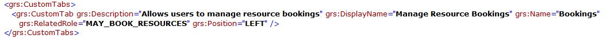
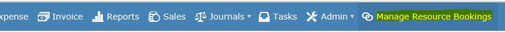
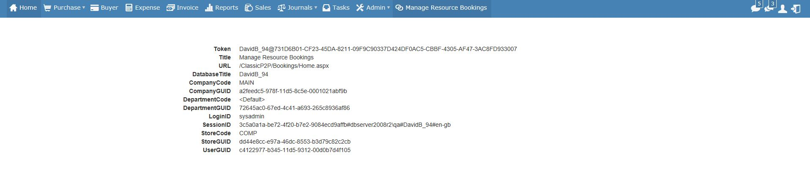
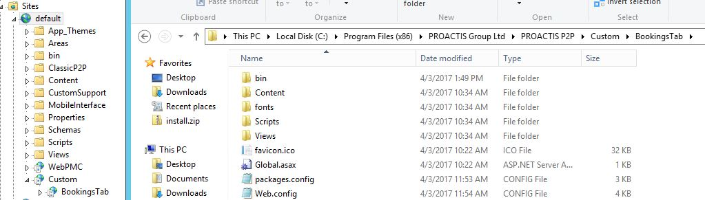
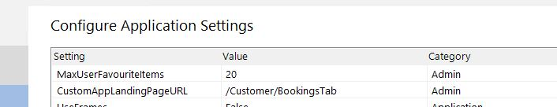

# Custom Tab

The P2P website can be extended by creating additional "custom" tabs.  

---

# Licence File

In order to display a custom tab you will first need a licence file which includes the name of the tab.  



!!! note
    
    Please contact your account manager for assistance with this.

In this example the tab will be displayed as  __Manage Resource Bookings__ and will only be visible to users with the __MAY_BOOK_RESOURCES__ user role.



---

# Development
Custom tab are developed as independent websites which are then displayed as part of the core site within an iFrame.



In the screenshot above,  the blue menu bar comes from the main site,  whilst the remainder of the page (in white) is the custom tab.


By convention the custom sites are placed within the WebSite\Custom folder and are mapped as a virtual application with in IIS.   




In order for P2P to know the URL of the page is displayed it's path needs to be added to the __web.config__ file.

 


!!! warning

    The website will be reset logging out existing users after the __web.config__ file is changed.

---

# Session Details
As the custom tab is running in a different website to the main site it is not possible to share the session state within IIS.

Instead the following steps must be followed in order to obtain the details of the current user.

+ Before the main site opens your landing page it first generates a unique session token which is stored in the database within the __dsdba.LoginTokens__ table.  This table also holds who the current user is. 

+ When the landing page is opened,  it is passed the following information as query string parameters
    - Token  (the unique token)
    - Title  (the name of the tab)
    - URL    (the url of the tab)

    The token argument is made up of the {Database's Title} @ {The unique generated session token}

+ The custom tab should then connect to the P2P database and call the __DSDBA.usp_cust_GetSessionDetailsFromToken__ stored procedure supplying the full token.  This stored procedure will return with a single row containing the following columns:

    - UserGUID
    - LoginID
    - CompanyGUID
    - CompanyCode
    - DepartmentGUID
    - DepartmentCode
    - StoreGUID
    - StoreCode
    - SessionID  (the internal P2P session ID)
    - Expires  (when the login token will expiry)

!!! warning

    The stored procedure will return a row even when the session ID is not valid.  In this case however all the values will be NULL.

---
# Please Wait Spinner
Whilst your tab is first loading the main site will be displaying the please wait spinner.  In order to remove the spinner the following javascript code should be added to the end of your first page

```javascript
    <script type="text/javascript">
        //Hide the spinner in the main window.
        $().ready(function () {
            parent.hideSpinner();
        });
    </script>
```    

---

# User Role Security
By default all users have access to the new tab.  If you wish to restrict access to only certain users then the name of a user role (or a custom role) can be specified for the tab within the licence file.

If you wish to create a custom role,  then you will also need to insert an entry into the __DSDBA.Roles__ table with the same name.

```sql
INSERT INTO DSDBA.Roles (GUID, Code, Description, Properties, CompanyGUID)
SELECT newID(), 'MAY_BOOK_RESOURCES', 'Users may use the bookings tab', '', C.GUID
  FROM DSDBA.Companies C
```  

---

# Example Application
Please see the [example application](https://github.com/proactis-documentation/ExampleApplications/tree/master/P2P/Custom%20Tab) for a complete implementation.

---

# Troubleshooting

If your custom tab does not appear then check the following

1.   Your licence file includes the section for your custom tab.
2.   If the RelatedRole has been specified in the licence file then the user has been granted that role.
3.   The URL of the custom page has been specified in the __web.config__ file


