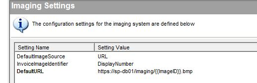

# Generic Imaging DLL

## Overview
The PROACTIS P2P product has been designed so that it can be easily integrated with a number of different Document Management Systems (DMS).

A typical PROACTIS imaging solution requires the following integration points:-
1.	The scanned image needs to be associated with an invoice within PROACTIS.

2.	Users need to be able to see the original scanned image by clicking a link within the PROACTIS web site.

Although there are many different possible methods available (as different DMS and customers have different requirements) a generic imaging DLL has been written which meets the majority of customer’s requirements.
This document describes how to install and configure this DLL.

## Beyond the Imaging DLL
If the “Generic Imaging DLL” does not meet your requirements,  then a custom DLL can written which implements the __grsImageIface.IImaging__ and __grsImageIface.IProcess__ interfaces.  The application server can then be configured to call this DLL when a user wishes to “process a new invoice” or view an existing scanned image.
The development of a custom DLL is not described within this page.

## Installing the Generic Imaging DLL

### Application Server
Within your __PROACTIS P2P/Plugins__  (or __Plugins/[database-title]__) folder create a file called __PROACTIS.P2P.proGenericImaging.dll__  This can be an empty text file.
.

## Configuring the imaging DLL

The “generic imaging” DLL supports two different sources for viewing scanned images.  They can be displayed either from an existing image file on the filesystem, or from an external URL.  Different sources can be defined for different document types.  For example, expense claims might exist as .gif files in a file share, whilst scanned images might be held in a document management system accessed via a webpage.
The configuration for the generic imaging DLL is carried out via the “Imaging Settings” snap in within the PROACTIS Management Console.
 
## Examples
In order to view an image via a URL held in an external DMS, the following settings would be required.

|Setting Name	|Description|
|---------------|------------|
|DefaultImageSource	| URL – the image is retrieved from the external system using an URL
| InvoiceImageIdentifier | DisplayNumber – the PROACTIS invoice number is used to identify the image in the DMS.
| DefaultURL |The tag {{ImageID}} will be replaced with the value of the InvoiceImageIdentifier when access the DMS.

## Additional Settings
The other available settings are detailed below:-

### The image source
The image source specifies where the image will be found and should have the value of either URL or FILE.

The DLL first checks for the value of {doctype}ImageSource setting.  _{doctype}_ is one of the following values depending on the type of document being viewed.

-	Invoice
-	CreditNote
-	Expense
-	Acceptance

If this setting does not exist, or is blank then the DLL checks for the value of DefaultImageSource
If no image source can be found for a document type or the value is not either FILE or URL, then the following error will be raised
“Invalid image source –“

### The image identifier
The DLL then determines how to identify the image.   Images can be identified by their
- ImageReference (Invoices and Credit Notes only)
- HeaderReference
- DisplayNumber

The “{doctype}ImageIdentifier” setting specifies which of these sources will be used for the {doctype} document type.  If the setting is not set for the current document type then the following defaults will be used
- Invoices and Credit Notes	-	ImageReference
- Expenses and Acceptances	-	HeaderReference

If HeaderReference has been specified for the xxx document type, then the name of the reference field must also be set in either the
- DefaultImageReference setting  
Or
- {doctype}ImageReference setting.

### Viewing Images from an URL
If the source type is determined to be a URL then the base URL is read from one of the following settings:
- InvoiceURL
- CreditNoteURL
- ExpenseClaimURL
- AcceptanceURL

If the setting is blank or does not exist, then the value of DefaultURL is used.

Once the URL has been determined, the image identifier is then appended to the end.  For example if the base URL is http://image-server.asp?ImageID=  and the ImageIdentifier is PINV1234 then the following URL will be used http://image-server.asp?ImageID=PINV1234

If the URL contains the markup tag {{ImageID}}  then instead of the ImageIdentifier being appended to the end of the URL it will replace the tag within the URL.
For example http://localhost/intranet/DMS/{{ImageID}}.bmp will become http://localhost/intranet/DMS/PINV1234.bmp
 

### Viewing Images from a FILE
If the source type is determined to be a FILE then the image folder is read from one of the following settings
- InvoiceFolder
- CreditNoteFolder
- ExpenseClaimFolder
- AcceptanceFolder
If the setting is blank or does not exist, then the value of DefaultFolder is used.

Next the mime type of the image file is resolved using the following settings
- InvoiceMIMEType
- CreditNoteMIMEType
- ExpenseClaimMIMEType
- AcceptanceMIMEType

If the setting is blank or does not exist, then the value of DefaultMIMEType is used.
If the value for the MIME type is still unknown then the DLL queries the registry for find the mime type registered for the file extensions.  This is held in HKEY_LOCAL_MACHINE\Software\Classes\{fileext}\Content Type where {fileext} is the file extension.
If a value still can’t be found then it defaults to a mime type of application/octet-stream
Once the MIME type and Folder is known, the complete target filename is generated by appending the image identifier to the folder.  For example if the folder is c:\Images and the ImageIdentifier is PINV1234.gif then the filename c:\Images\PINV1234.gif will be displayed.

 
## The “Generic Imaging DLL” - Processing

### Display of the Process Images Link
To determine if the “Process Images” link should be displayed the following setting is queried
- ProcessInvoice
- ProcessCreditNote
- ProcessExpenseClaim
- ProcessAcceptance

If the setting is missing or blank then the ProcessDefault setting will be used.
If it has a value of ALWAYS then the link will always be displayed.  If the setting is NEVER then the link will always be hidden.  Otherwise the link will only be displayed if there are some images to process.
This allows the Process scanned image functionality so be available for some document types but not for others.

### Listing Images From the Database
If the image source for the document type is URL (see above) then the list of available images is determined by querying the database.
The DLL then selects from the “dsdba.view_cus_UnprocessedDocumentImages” database view.  This view must be customised to select from your images database.
Each of the columns returned by the view will then be displayed within a table on the website.
One of the columns must be designated as a key column,  this means that it uniquely identifies the image.
The key column is defined by the following setting
- InvoiceProcessKey
- CreditNoteProcessKey
- ExpenseClaimProcessKey
- AcceptanceProcessKey

If the setting is missing or blank then the ProcessKeyDefault setting will be used.

### Listing Images From a folder
If the image source for the document type is FILE (see above) then the list of available images is determined by the files in an existing folder.
The folder is determined by the following setting
- InvoiceProcessFolder
- CreditNoteProcessFolder
- ExpenseClaimProcessFolder
- AcceptanceProcessFolder

If the setting is missing or blank then the ProcessFolderDefault setting will be used.

The system can be configured so that each user can have their own folder of images.  If the following setting is set to YES then the users loginID will be appended to the folder name
- InvoicePostfixLogin
- CreditNotePostfixLogin
- ExpenseClaimNotePostfixLogin
- AcceptancePostfixLogin

If the setting is missing or blank then the DefaultPostfixLogin setting will be used.
For example, if the folder is C:\Images and the post fix login is YES and the username is DAVID then the folder c:\Image\David will be used.

### Processing Database Images
Once an image held in the database has been processed then image identifier is then set against the document within PROACTIS.

### Processing File Images
Once a file image has been processed then the file is moved into a processed folder.  The folder is determined from the following setting.
- InvoiceProcessFolder
- CreditNoteProcessFolder
- ExpenseClaimProcessFolder
- AcceptanceProcessFolder

If the setting is missing or blank then the DefaultProcessFolder setting will be used.
The file can also be renamed as it’s moved when the following setting is set to YES
- InvoiceFileRename
- CreditNoteFileRename
- AcceptanceFileRename
- ExpenseClaimFileRename

If the setting is missing or blank then the DefaultFileRename setting will be used.

## Summary of Settings
| Setting Name	|Example	| Description
|---------------|-----------|-----------
|InvoiceImageSource	|FILE or URL	|The source for viewing invoice files
|CreditNoteImageSource|	FILE or URL	|The source for viewing credit note files
|AcceptanceImageSource|	FILE or URL	|The source for viewing acceptance files
|ExpenseImageSource	|FILE or URL	|The source for viewing expense claim files
|DefaultImageSource	|FILE or URL	|Source used when the above setting is blank or missing
|ExpenseClaimImageReference	|IMAGE	|The code of the reference field on an expense claim which holds the identifier of the image.
|AcceptanceImageReference	|BARCODE	|The code of the reference field on an acceptance document which holds the identifier of the image.
|DefaultImageReference|	ID	|The reference field used when the above settings are blank or missing
|InvoiceURL	| http://images?ID=	| The prefix for the URL used for displaying invoices.
|CreditNoteURL	|https://images?Doc=|The prefix for the URL used for displaying credit notes.
|ExpenseClaimURL	| http://127.0.0.1?BarCode= | The prefix for the URL used for displaying expense claims.
| AcceptanceURL | 	http://www.images.com?ID | The prefix for the URL used for displaying acceptance documents.
|DefaultURL	| http://img-server?type=PROACTIS&ID=	|The URL used when the above settings are blank or missing
| InvoiceFolder |	C:\Images	| The folder containing the invoice images
| CreditNoteFolder | 	\\file-server\Images | The folder containing the credit note images
| ExpenseClaimFolder | 	\\127.0.0.1\Images | The folder containing the expense claim images
| AcceptanceFolder | 	C:\Images	| The folder containing the acceptance document images
| DefaultFolder ||		The Folder used when the above settings are blank or missing
