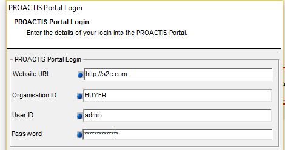
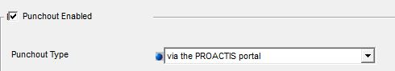
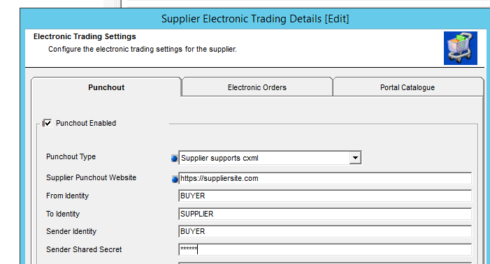
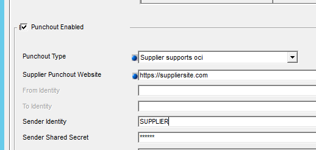
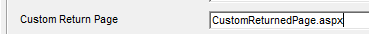

# PunchOut

## Overview
PunchOut allows a user to jump from the PROACTIS P2P website into a supplier’s shopping site.  Where they can browse a catalogue and add items to a shopping basket as per a normal e-commerce site.  Once they have finished browsing they click checkout and the items are then returned to PROACTIS as new lines on their current purchase order (or requisition).
For the purposes of this document, the term PunchOut does not include the ability to electronically export purchase orders to suppliers in cXML format.

!!!Note 

    This document details how to configure connections to supplier PunchOut sites and marketplaces in the latest release of PROACTIS P2P `17.
    Unlike the previous versions it is now possible to configure the connections directly within the product.  Previously the setup action was carried out by a technical consultant which required the coding of bespoke webpages and sometimes DLLs for installation on the P2P server.

---

## PunchThro.   
There are three different methods of configuring PunchOut within the PROACTIS P2P product.   This first is referred to as punch-thro.  This is where the buyer connects to the suppliers PunchOut site via the PROACTIS S2C portal. 

As the details of the suppliers site are configured in the PROACTIS S2C Portal the only P2P settings required are as shown below

+   Configure the connection to your PROACTIS S2C portal.  (__Application__ -> __PROACTIS Connectivity__)



+   Enable the PunchOut via portal setting against the supplier.



---

## cXML PunchOut 

The majority of PunchOuts follow the [cXML](http://cxml.org/) standard.  This can be configured directly within the P2P product by completing the following fields against a supplier.
 



!!! Note

    +   The values for these 5 fields should be agreed with the supplier however DUNs numbers are often used for the three identities.
    +   The fields can also be edited using the new WebPMC.

---

## OCI PunchOut

Less commonly used in the UK, but PROACTIS also supports the [Open Catalog Interface](https://en.wikipedia.org/wiki/Open_Catalog_Interface) (OCI) PunchOut standard.  Again this can be configured directly within the product by completing the following three fields.
 


!!! Note

    The supplier will normally provide you with their URL and your sender identity and secret.


---

## PunchOut customisations
It is possible to customise PunchOut at various points within the process:

### cXML Handshake
The format of the cXML sent in the initial connection to the supplier’s site is generated from an XML using an XSLT transformation.  By default PROACTIS uses an XSLT embedded within the product however it is possible to use your own xslt by creating a file within the plugins folder called __PunchoutConnection_{supplierCode}.xslt__.  Where _{supplierCode}_ is the code of your supplier.

The fields which are available to the XSLT are listed below.

+ Context
+ SessionID
+	SupplierCode
+	DepartmentCode
+	CompanyCode
+   TemplateLabel
+	LogonName
+	ActualName
+	FirstName
+	Surname
+	Email
+	ReturnURL
+	URL
+	BuyerCookie
+	PayloadID
+	Timestamp
+	PunchoutFromIdentity
+	PunchoutToIdentity
+	PunchoutSenderIdentity
+	PunchoutSenderSharedSecret
+	DeliveryAddressGUID
+	DeliveryAddressName
+	DeliveryAddressLine1
+	DeliveryAddressLine2
+	DeliveryAddressLine3
+	DeliveryAddressLine4
+	DeliveryCountry
+	DeliveryCounty
+	DeliveryPostcode
+	DeliveryPostTown

An example XSLT document is available [here](https://github.com/proactis-documentation/ExampleApplications/tree/master/P2P/Punchout/Connections).

 
### cXML & OCI Returned Basket
When the basket is returned from the supplier by default it is transformed into the correct P2P format by using an XSLT embedded within the product.  This can be replaced by your own transform by creating a file in the plugins folder called __ReturnedPunchoutBasket_{supplierCode}.xslt__ Where _{supplierCode}_ is the code of your supplier.
The XSLT must generate XML in the following format:

```xml
<PurchaseOrder>
  <PurchaseOrderHeader>
    <SessionID></SessionID>
    <Currency></Currency>
    <TotalValue></TotalValue>
  </PurchaseOrderHeader>
  <PunchOutDetail>
    <Item>
      <Product></Product>
      <Quantity></Quantity>
      <Description></Description>
      <UnitOfMeasure></UnitOfMeasure>
      <UnitValue></UnitValue>
      <Currency></Currency>
      <UNSPSCCode></UNSPSCCode>
      <Supplier></Supplier>
      <References>
        <Reference name=""></Reference>
      </References>
    </Item>
  </PunchOutDetail>
</PurchaseOrder>
```

An example XSLT document is available [here](https://github.com/proactis-documentation/ExampleApplications/tree/master/P2P/Punchout/BasketResponses).

### Custom Return Page
By default the supplier posts their basket back to either __PunchoutReturned.aspx__ (for cxml) or __PunchoutReturnedOCI.aspx__ (for oci).  It is however possible for you to provide your own page for processing the returned basket.  This is configured by completing the following field against the supplier record.



This page should be placed in the Customer folder within the website.


The default __PunchoutReturned.aspx__ page looks for the basket xml in the following form fields:

1.	XML
2.	cxml-urlencode
3.	cxml-urlencoded
4.	cXML-base64
5.	oracleCart
6.	the first form field

The default __PunchoutReturnedOCI.aspx__ page looks for the basket xml in the form fields as follows:

1. The items are returned in arrays of fields.  Indexed from 1 onwards
2. First it checks there is a field called NEW_ITEM+DESCRIPTION[1].  If there isn’t then it assumes that no basket items were returned.
3. It then loops through all fields which are named in the format NEW_xxxxx[n] where xxxxx is the name of a property and n is the item number.
4. Each of these form fields are then added into the xml.  The result xml will have the following format:
```xml
<PurchaseOrder>
	<line number=1 item+description=’red pen’ etc etc />
</PurchaseOrder>
```
 

# Market Place
PROACTIS P2P allows users to connect to a “market place” where they can then browse catalogues of one or more suppliers.  When they have finished browsing and click check-out then their returned basket is used to create one or more draft purchase orders (or requisitions) within PROACTIS.
Unlike previous versions of PROACTIS it is now possible to configure marketplace connections directly within the product.

## Configuration
Using the “System Control” application choose the Marketplaces option from the Supplier Maintenance menu.  Add a New market place and complete both the Details and PunchOut sections.
 
 
The following marketplace types (standards) are currently supported:

+	CXML
+	PROACTIS EGS
+	Procserve
+	Science warehouse

The Supplier Code Mapped From field specifies how the supplier code in the returned basket is mapped back to the suppliers within PROACTIS.


## Customisation
The xml used for the initial connection is generated using an xslt embedded within the product.  It is possible to provide your own xslt by creating a file in the plugins folder called __MarketPlaceConnection_{marketPlaceName}.xslt__.  Where _{marketPlaceName}_ is the name of the configured marketplace.
The fields passed into the xml are listed below:

+	DepartmentCode
+	CompanyCode
+	LogonName
+	Email
+	ReturnURL
+	URL
+	BuyerCookie
+	PayloadID
+	Timestamp
+	PunchoutFromIdentity
+	PunchoutToIdentity
+	PunchoutSenderIdentity
+	PunchoutSenderSharedSecret

When the basket is returned from the market place by default it is transformed into the correct format by using an XSLT embedded within the product.  It is possible to provide your own xslt by creating a file in the plugins folder called __MarketPlaceResult_{marketPlaceName}.xslt__.  Where _{marketPlaceName}_ is the name of the configured marketplace.
The xslt needs to generate xml in the following format
```xml
<PurchaseOrder>
  <PurchaseOrderHeader>
    <SessionID></SessionID>
    <Currency></Currency>
    <TotalValue></TotalValue>
  </PurchaseOrderHeader>
  <PunchOutDetail>
    <Item>
      <Product></Product>
      <Quantity></Quantity>
      <Description></Description>
      <UnitOfMeasure></UnitOfMeasure>
      <UnitValue></UnitValue>
      <Currency></Currency>
      <UNSPSCCode></UNSPSCCode>
      <Supplier></Supplier>
      <References>
        <Reference name=""></Reference>
      </References>
    </Item>
  </PunchOutDetail>
</PurchaseOrder>
``` 

## EGS Marketplaces
The EGS settings within the PROACTIS Connectivity snapin, do not refer to marketplace PunchOut.  This are used to configure different functionality not covered by this document.
 

# Proxy Server
Connections to both supplier PunchOut, and marketplaces honour the proxy server settings held in the __dsdba.ProxySettings__ table.
This can be configured using the System Control application.
 